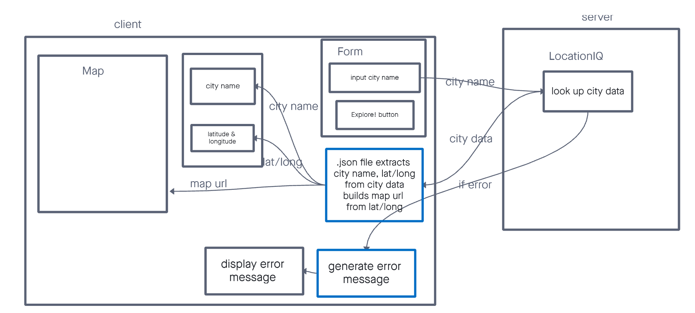

# city-explorer-api

**Author**: Suhaib alnaji
**Version**: 1.0.0 (increment the patch/fix version number if you make more commits past your first submission)

## Overview
This will be a backend server intermediary which serves a front end app for mapping services. Users of the front-end app will request information about an area, and this will provide that information to the front-end

## Getting Started
Clone the repo
NPM install to load dependencies
NPM start
Requests must be pinted to the IP the server is running at.

## Architecture

## Change Log
<!-- Use this area to document the iterative changes made to your application as each feature is successfully implemented. Use time stamps. Here's an example:

01-01-2001 4:59pm - Application now has a fully-functional express server, with a GET route for the location resource. -->

## Credit and Collaborations

Lab 7, Feature 1: Weather Placeholder
Estimate of time needed to complete: 4h

Start time: 4:00 PM Wednesday

Finish time: 8:30 PM sunday

Actual time needed to complete: 8h, with breaks

Lab 8, Feature 1: Live Weather
Estimate of time needed to complete: 1.5h

Start time: 8:30 PM Thursday

Finish time: 9:00 PM sunday

Actual time needed to complete: 1h

Lab 8, Feature 2: Movies
Estimate of time needed to complete: 1.5h

Start time: 9:00 PM Thursday

Finish time: 10:30 PM sunday

Actual time needed to complete: 1.5h

